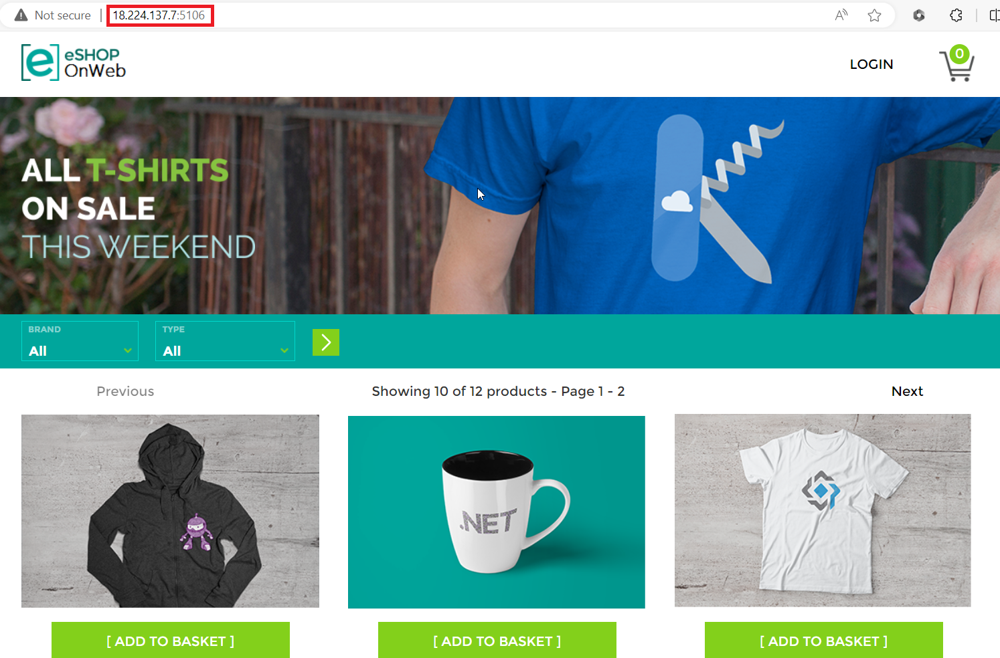
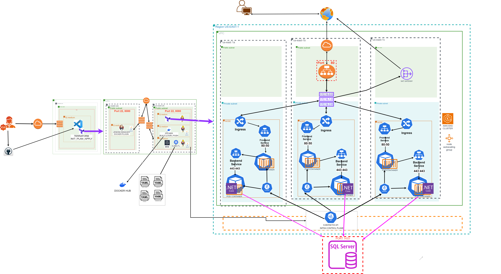

# <ins>Final Deployment</ins>

#### December 13, 2023

### *Project Manager:* Jo White
### *Chief Architect:* Sameen Khan
### *System Administrator:* Danielle Davis
### *Team Director:* Annie Lam

_______________________________________________________
## <ins>Purpose:</ins>

_________________________________________________________________

## <ins>Description</ins>

As our deployment journey progressed, we utilized docker-compose, EKS, and ECS. 
_____________________________________________________________

## <ins>ASP.Net Core Application:</ins>

-passionate about optimizing user experience and client satisfaction. The fairly new Microsoft application framework adds flexibility and lower latency 



_____________________________________________________________

### <ins>Infrastructure:</ins>


_____________________________________________________________

### <ins>Deployment Strategy:</ins>

Rolling Deployment strategy
Ansible makes it easier for us to update any instance without having to go into Terraform. The Ansible tool helps us reduce the risk of configuration drift


________________________________________________________________________

### <ins>Deployment Steps:</ins>

__________________________________________________________


# Git/GitHub
Branch
Merge====

<ins>Git Commits taken by the team</ins>:

* *git clone* - Used VS code editor to easily make changes to my remote repo on GitHub

* *cd .git, nano config* - Added GitHub URL for the main repo in my .git config file to give VS code permission remote repo

* *git branch second* - to create and make changes in the second branch 

* *git merge* - to resolve any merging conflicts and resolve files 

* *git add .*  - to update changes in each branch

* *git commit -m "message"* - to finalize changes to repo with message description

* *git push* - push changes back to remote GitHub repo

_______________________________________________________________________________________________________

<summary>Jenkins infrastructure</summary>
•	1 Subnet with one instance for the Jenkins Manager
•	1 Subnet with three instances, that can be detached from the igw and attached to the nat gateway to make it private
        - 1 instance for Jenkins agent, where Docker and Docker-compose are installed to build the Docker images for the frontend and the backend
        - 1 instance for Jenkins agent, where Terraform is installed to create the application infrastructure
        - 1 instance for Jenkins agent, where Kubectl is installed to create the Kubernetes infrastructure and deploy the application to EKS

**<ins>Application infrastructure [.tf](path to file):**

•	1 VPC *(avoids any network conflicts, flexible network design, & isolates EKS cluster from other resources in AWS account)*
•	3 Availability Zones
•	1 Private Subnet and 1 Public Subnet in each Availability Zones

**<ins>Kubernetes infrastructure [.tf](path to file):**

•	1 EKS Cluster
•	Kubernetes API in the Infrastructure Control Plane
•	1 node in each Private Subnets:  
•	In each of the nodes:
        - kubelet
        - application layer pod/container (deployment)
        - application service
        - web layer pod/container (deployment)
        - web service
        - ingress
•	In one of the Public Subnets:  
        - Application Load Balancer
•	1 Private Subnet and 1 Public Subnet in each Availability Zones

**<ins>ECS  infrastructure [.tf](path to file):**

•	1 VPC *(avoids any network conflicts, flexible network design, & isolates EKS cluster from other resources in AWS account)*


___________________________________________________________________________________________________________________________


Dockerfiles:</ins>**

**</ins>The [Dockerfile](Dockerfile.frontend)</ins> under Web files contain the frontend image:**

•	The image contains the dependencies for the default kestel web server that comes within the ASP.Net Core application code.


______________________________________________________________________________________________________
**<ins>The [Dockerfile](Dockerfile.backend)</ins> under API files contain the backend image:**

•	The image contains an ASP.Net Core REST API and its pip dependencies. 

added  the stress command to stress test our server 


_________________________________________________________________________________________________________________


**<ins>Provided AWS & Docker credentials for Jenkins:</ins>**

**For AWS:**

•	The ```Deploy to EKS``` stage in the Jenkins pipeline needs AWS credentials to execute the ```kubectl apply``` that creates the Kubernetes objects in our EKS cluster. The AWS access key and secret keys are stored as secret text in the Jenkins credentials utility. The credentials are then called by the Jenkinsfile and passed to the ```kubectl``` command in the Jenkinsfile.

Jenkins needs our AWS credentials to create our infrastructure through the terraform agent


**For Docker:**

•	The Jenkins pipeline needs credentials from the Docker Hub where the images for the frontend and backend are publicly stored so other developers can access it in the future. The Jenkinsfile build stages use the Docker Hub username and token to login to Docker Hub and push the built image to the repository.

•	Provisioned the agent nodes: The nodes for our cluster are provisioned in the private subnets as a measure of security. Neither the frontend or backend pods are directly accessible. The frontend ingress receives traffic only through the load balancer. The frontend containers access the backend through the backend service. 


_____________________________________


Docker-compose Jenkinsfile:

___________________________________________________________

ECS Jenkinsfile:

_______________________________________________________


EKS Jenkinsfile:

**<ins>Configured *staging environment* with [Jenkins infrastructure](main.tf) and CI/CD pipeline stages with [Jenkinsfiles](Jenkinsfile):</ins>**

**[Jenkins](jenkins-deadsnakes2.sh) manager server:** Installed with Jenkins. This main server sends the necessary build scripts and files to each agent/virtual machine reducing resource contention and configuration drift.

**<ins>Stage: Environment variables:</ins>**

*DOCKERHUB_CREDENTIALS** *(to connect Jenkins pipeline to our docker image storage tool to create/run containers created for deployment)

*AWS_EKS_CLUSTER_NAME** (so that our application could deploy to our pre-existing cluster environment in our private network)
        
*AWS_EKS_REGION** (to create cluster in us-east-1 region)*
        
*KUBE_MANIFESTS_DIR** (to direct EKS commands to deploy using the yaml files in this directory)*

**<ins>Stages: *Build backend* & *Build frontend*:</ins>**

**[Docker](dockeragent2.sh) agent server:** The docker agent receives the job execution request from the main server when our pipeline initiates when the Docker build stages are triggered through Jenkins when we select “Build Now”: 

 *Docker build* to create images described within our Docker files for the application’s front-end and back-end.

 *Docker login* to provide access to our Docker Hub account which is instrumental in connecting our application image to our Kubernetes pods/containers.

 *Docker push* to push the latest image version back to Docker Hub so that our changes to our main repo are reflected correctly in our application code.

**<ins>Stage: Deploy to EKS:</ins>**

**<ins>Manually configured Cluster and node groups from [EKS](eks-jre.sh) agent server:</ins>** 

•	The EKS agent server triggers the necessary job to *Deploy* when triggered in the Jenkins pipeline. It also acts as the bastion host and as a gateway or entry point into our private network where our EKS cluster = *eksctl create cluster DepCluster9 --vpc-private-subnets=”pri_subnet,pri_subnet”  --vpc-public-subnets=”pub_subnet,pub_subnet” --without-nodegroup* and node groups were provisioned separately in order to customize out node groups =  * eksctl create nodegroup --cluster DepCluster9 --node-type t2.medium --nodes 2*.

•	I also manually configured the ALB controller for traffic management and the CloudWatch agent on the server for monitoring (explained further below).

**<ins>Stage: Slack notification:</ins>**

*<ins>Found documentation on the Slack API and utilizing a webhook URL to broadcast messages to the team on our designated Slack channel:</ins>*

•	For Slack access on Jenkins: Configured credentials as a “secret text” like how we enter our AWS keys. Defined and set variables for slack webhook URL within Jenkinsfile to avoid directly hard coding and leaking our URL onto GitHub again. 


______________________________________________________________


**<ins>Kubernetes manifest:</ins>**

<ins>The Kubernetes objects that are included in the EKS Cluster are an ingress, 2 services, and 2 deployments for each node:</ins>

•	The [ingress.yaml](/KUBE_MANIFEST/ingress.yaml) defines the ingress that received traffic from the load balancer and allows it into the node. 

<ins>The [service.yaml](/KUBE_MANIFEST/service.yaml) includes the services for both the backend and frontend. Each service forwards traffic to the respective frontend and backend containers defined in the deployment.yaml:</ins>

- The frontend service depends on the API to target the traffic from the load balancer  
    

* EKS takes care of many services necessary for our application to work including our target zones so that our ALB gets automatically directed to the ones opened in our services:


    
<ins>The [deployment.yaml](/KUBE_MANIFEST/deployment.yaml) defines the configurations for the containers based on the backend and frontend images:</ins>

- The frontend image is configured to point to the backend service ``` "proxy": "http://d9-backend-service-nodeport:8000" ```

_________________________________________________________________________________________________________


**<ins>Access to Application:</ins>**

* Provided permission to my AWS account to interact with our cluster through *OpenID*

* Added new tags: the key being: “kubernetes.io/role/elb” and the value: “1” so that  Kubernetes could identify the suitability of our public subnets to host our application load balancer. 

* Downloaded iampolicy.json file in our EKS cluster to define what is allowable and what isn’t when accessing our application. 

* Downloaded “AWSLoadBalancerControllerIAMPolicy to give permission to my cluster to use my ALB controller.

* Create a service account that is used to control access to our ingress controller to interact with our ALB in our EKS cluster.

* Created certificate manager to secure the traffic from clients and associated ingress (incoming traffic) controller with the associated domain name that will be created to access our application through the load balancer.

* List of polocies under the AWSLoadBalancerControllerRole on our worker nodes (2 instances configured to spin back up if ever terminated:


 ______________________________________________________________________________________________________
**<ins> Configured ALB controller:</ins>**

•	Downloaded v2_4_5_full.yaml file from GitHub: 
```wget https://github.com/kubernetes-sigs/aws-load-balancer-controller/releases/download/v2.4.5/v2_4_5_full.yaml``` which acts as our *IngressClass.yaml* file to define the ingress controller we’re creating to handle the ALB controller resource to balance traffic load. *changed cluster name to our EKS cluster*

•	Configure the Kubernetes ingressclass.yaml file to our cluster by running: ```kubectl apply -f v2_4_5_full.yaml```

•	Lasty, I ran: ```kubectl apply -k "github.com/aws/eks-charts/stable/aws-load-balancer-controller/crds"``` to apply Kubernetes resources that we download from an ingressclass.yaml file with pre-configured resource definitions so that AWS can manage the resources necessary to run the ALB efficiently.

</ins>

______________________________________________________________________________________________________
**<ins>Installed cloudwatch agent:</ins>** 

*<ins>Found documentation for easy installation on AWS:</ins>*

•	The following command attaches a role policy to my cluster by updating the policies under my IAM role to include the *CloudWatchAgentServerPolicy*:
  
```aws iam attach-role-policy \--role-name *name of IAM policy on worker-nodes* \ --policy-arn arn:aws:iam::aws:policy/CloudWatchAgentServerPolicy```

* <ins>The following command installs the necessary add-on for CloudWatch monitoring to observe and function properly:</ins>*

```aws eks create-addon --cluster-name * pre-existing cluster-name* --addon-name amazon-cloudwatch-observability```

Purpose


Cloudwatch log groups:


## <ins>Issues</ins>


503 errors when trying to deploy the application within EKS and ECS clusters. 
Connecting to an application load balancer


__________________________________________________________
_______________________________________________________________________
## <ins>Budget</ins>

_________________________________________________________


**<ins>Conclusion</ins>**


________________________________________________________________________________________________

**<ins>Optimization</ins>**

Fault tolerance: Multiple AZ’s
Resiliency: Private subnets
Scalability: Ansible
High throughput: Route 53, 


