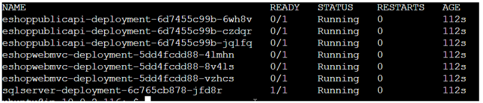

# <ins>Final Deployment</ins>

#### December 13, 2023

### *Project Manager:* Jo White
### *Chief Architect:* Sameen Khan
### *System Administrator:* Danielle Davis
### *Team Director:* Annie Lam

_______________________________________________________
# <ins>Purpose:</ins>

Deploy an e-commerce application on EKS, but as our deployment journey progressed, we utilized docker-compose, EKS, and ECS.  This documentation focuses on the deployment of EKS
_________________________________________________________________

# <ins>ASP.Net Core Application:</ins>

-passionate about optimizing user experience and client satisfaction. The fairly new Microsoft application framework adds flexibility and lower latency 


_____________________________________________________________

### <ins>Infrastructure Diagram:</ins>


_____________________________________________________________

# Git/GitHub

Git is a distributed version control system designed to track changes in source code during software development. It allows multiple developers to collaborate on projects seamlessly by managing code repositories efficiently. GitHub, on the other hand, is a web-based platform that provides Git repository hosting along with collaboration features. GitHub serves as a centralized hub for developers to store, share, and contribute to Git repositories. It includes features like pull requests, issue tracking, and wikis, enhancing collaboration and making it a widely adopted platform for open-source and private projects alike. Together, Git and GitHub empower developers with a powerful version control system and a collaborative platform for effective and organized software development workflows.

Branch
Merge====

<ins>Git Commits taken by the team</ins>:

* *git clone* - Used VS code editor to easily make changes to my remote repo on GitHub

* *cd .git, nano config* - Added GitHub URL for the main repo in my .git config file to give VS code permission remote repo

* *git branch second* - to create and make changes in the second branch 

* *git merge* - to resolve any merging conflicts and resolve files 

* *git add .*  - to update changes in each branch

* *git commit -m "message"* - to finalize changes to repo with message description

* *git push* - push changes back to remote GitHub repo

_______________________________________________________________________________________________________

# Deployment Strategy:

Rolling Deployment strategy - Ansible makes it easier for us to update any instance without having to go into Terraform. The Ansible tool helps us reduce the risk of configuration drift

## Ansible 
Ansible is a versatile automation tool that streamlines complex IT processes, ideal for managing system configurations, deploying applications, and orchestrating workflows across various environments. Its simplicity, stemming from an agentless setup and easy-to-understand YAML-based playbooks, makes it accessible for both small and large-scale operations. This scalability and flexibility make Ansible a key asset in DevOps, boosting efficiency and ensuring consistent delivery of IT services.

- Install SSH: Install OpenSSH server on your machine. `sudo apt install openssh-server`
- Generate SSH Keys: Generate a key for default use and another specifically for Ansible. `ssh-keygen -t ed25519 -C 'jo default'```ssh-keygen -t ed25519 -C "ansible"`
- Copy SSH Keys to Hosts: Use ssh-copy-id to copy keys to your remote hosts. `ssh-copy-id -i ~/.ssh/id_ed25519.pub your-ip
ssh-copy-id -i ~/.ssh/ansible.pub your-ip`
- Remote Login: Use the specific key to log into the remote host. `ssh -i ~/.ssh/ansible host-ip`

### Ansible Configuration File (.cfg)
Create a configuration file for Ansible settings:

- [Ansible Config File ](ansible.cfg)

### Inventory File Setup
Define your managed hosts in the inventory file:

- [Inventory](Inventory)

### Playbook File
Create playbook with .yml file run using ‘ansible-playbook --ask-become-pass -vvv .yml’:

- [Playbook](install_.yml)

_____________________________________________________________

# Docker

Docker is an open-source platform that utilizes containerization to package and distribute applications along with their dependencies in a consistent and portable manner. It enables developers to create, deploy, and run applications seamlessly across different environments. A Dockerfile, on the other hand, is a script that defines the configuration and steps required to build a Docker container image. This text file specifies the base image, sets up the environment, and defines the series of commands to be executed, resulting in a reproducible and automated process for building Docker images. Together, Docker and Dockerfiles streamline the development and deployment workflow, making it easier to create, share, and deploy applications in isolated and self-contained environments.

## The [Dockerfile](src/Web/Dockerfile) under Web files contain the frontend image:

•	The image contains the dependencies for the default Kestel web server that comes within the ASP.Net Core application code.

## The [Dockerfile](src/PublicApi/Dockerfile) under API files contain the backend image:

•	The image contains an ASP.Net Core REST API and its pip dependencies. 

# Terraform

Terraform is an open-source Infrastructure as Code (IaC) tool developed by HashiCorp, designed to simplify and automate the provisioning and management of infrastructure across various cloud providers and platforms. Its power lies in its declarative configuration language, which allows users to express the desired state of their infrastructure efficiently. Terraform's multi-cloud support, modular design, state management, and execution plans empower users to create, modify, and maintain complex infrastructure with consistency and reliability. By treating infrastructure as code, Terraform enhances collaboration, ensures version control, and facilitates scalable and automated deployment processes, making it an invaluable tool for modern IT and DevOps teams.

In this project, terraform was used to provision the Jenkins, the Application, and the Kubernetes Infrastructure

# Jenkins

Jenkins is used to automate the Build, Test, and Deploy the Banking Application. To use Jenkins in a new EC2, all the proper installs to use Jenkins and to read the programming language that the application is written in need to be installed. In this case, they are Jenkins, Java, and Jenkins' additional plugin "Pipeline Keep Running Step", which is manually installed through the GUI interface.

## Credentials for Jenkins:

### For AWS:

•	The ```Deploy to EKS``` stage in the Jenkins pipeline needs AWS credentials to execute the ```kubectl apply``` that creates the Kubernetes objects in our EKS cluster. The AWS access key and secret keys are stored as secret text in the Jenkins credentials utility. The credentials are then called by the Jenkinsfile and passed to the ```kubectl``` command in the Jenkinsfile.

Jenkins needs our AWS credentials to create our infrastructure through the terraform agent

### For Docker:

•	The Jenkins pipeline needs credentials from the Docker Hub where the images for the frontend and backend are publicly stored so other developers can access it in the future. The Jenkinsfile build stages use the Docker Hub username and token to login to Docker Hub and push the built image to the repository.

•	Provisioned the agent nodes: The nodes for our cluster are provisioned in the private subnets as a measure of security. Neither the frontend or backend pods are directly accessible. The frontend ingress receives traffic only through the load balancer. The frontend containers access the backend through the backend service. 


## Jenkins infrastructure [(files)](jenkinsTerraform/)

•	1 Subnet with one instance for the Jenkins Manager

•	1 Subnet with three instances, that can be detached from the igw and attached to the nat gateway to make it private

        •	1 instance for Jenkins agent, where [Docker and Docker-compose](jenkinsTerraform/dockeragent2.sh) are installed to build the Docker images for the frontend and the backend
        
        •	1 instance for Jenkins agent, where [Terraform](jenkinsTerraform/terraform.sh) is installed to create the application infrastructure
        
        •	1 instance for Jenkins agent, where [kubectl](jenkinsTerraform/eks-jre.sh) is installed to create the Kubernetes infrastructure and deploy the application to EKS

        
# Application infrastructure [(files)](initTerraform/):

•	1 VPC *(avoids any network conflicts, flexible network design, & isolates EKS cluster from other resources in AWS account)*

•	3 Availability Zones - An application is deployed in more than one availability zone to enhance its availability and fault tolerance by distributing its components across multiple geographically isolated data centers, ensuring continued operation in the event of a single zone failure.

•	1 Private Subnet and 1 Public Subnet in each Availability Zones - An application is deployed in a private subnet to enhance security by restricting direct internet access, limiting the attack surface, and requiring traffic to pass through controlled entry points like a load balancer or a bastion host for improved network isolation.

# Kubernetes  infrastructure [(files)](KUBE_MANIFEST/):

Kubernetes is an open-source container orchestration platform that automates the deployment, scaling, and management of containerized applications. Its power lies in providing a robust and standardized framework for container orchestration, allowing users to efficiently manage and scale containerized workloads across a cluster of machines. Kubernetes abstracts the complexity of container deployment, load balancing, and resource allocation, offering features like automatic scaling, rolling updates, and self-healing. This enables organizations to achieve high availability, resilience, and scalability for their applications, fostering a cloud-native approach to development and operations. Kubernetes has become a cornerstone in modern containerized application architectures, providing a consistent and powerful platform for deploying and managing distributed systems.

•	1 EKS Cluster

•	Kubernetes API in the Infrastructure Control Plane

•	1 node in each Private Subnets:  

•	In each of the nodes:

        •	kubelet
        
        •	application layer pod/container (deployment)
        
        •	application service
        
        •	web layer pod/container (deployment)
        
        •	web service
        
        •	ingress
        
•	In one of the Public Subnets:  

        •	Application Load Balancer -to evenly distribute incoming network traffic across resources to optimize resource utilization, improve application availability, and ensure efficient handling of requests.
        
## [Instructions](https://github.com/LamAnnieV/K8s_configuration.git) to configure the EKS Cluster and Application Load Balancer

## Kubernetes manifest [(files)](KUBE_MANIFEST/):

The Kubernetes objects that are included in the EKS Cluster are an ingress, 2 services, and 2 deployments for each node and a load balancer:

- The [ingressclass.yaml](/KUBE_MANIFEST/Ingressclass.yaml) provisions the Application Load Balancer. 

- The [ingress.yaml](/KUBE_MANIFEST/ingress.yaml) defines the ingress that received traffic from the load balancer and allows it into the node. 

- The [service.yaml](/KUBE_MANIFEST/service.yaml) includes the services for both the backend and frontend. Each service forwards traffic to the respective frontend and backend containers defined in the deployment.yaml:

        - The frontend service depends on the API to target the traffic from the load balancer  
    
- The [deployment.yaml](/KUBE_MANIFEST/deployment.yaml) defines the configurations for the containers based on the backend and frontend images

          - The frontend image is configured to point to the backend service

_________________________________________________________________________________________________________

# CI/CD Pipeline [(Jenkinsfile)](Jenkinsfile)


## Init Terraform

To provision the application infrastructure

## Build Images

Uses docker-compose build to build the frontend and the backend images from dockerfiles

## Login and Push

Login to DockerHub and pushes the images to DockerHub

## Deploy to EKS

Provisions the EKS infrastructure and deploys the application

______________________________________________________________________________________________________

# Cloudwatch agent

Documentation for Cloudwatch agent on AWS

•	The following command attaches a role policy to my cluster by updating the policies under my IAM role to include the *CloudWatchAgentServerPolicy*:
  
```aws iam attach-role-policy \--role-name *name of IAM policy on worker-nodes* \ --policy-arn arn:aws:iam::aws:policy/CloudWatchAgentServerPolicy```

•	The following command installs the necessary add-on for CloudWatch monitoring to observe and function properly:

```aws eks create-addon --cluster-name * pre-existing cluster-name* --addon-name amazon-cloudwatch-observability```


# Issues

There were issues connected to Azure SQL database outside the Docker environment, which resulted in  503 errors when trying to deploy the application within EKS clusters. When deploying outside Docker environment, Azure key-vault, AZURE_KEY_VAULT_ENDPOINT, AZURE_SQL_CATALOG_CONNECTION_STRING_KEY and AZURE_SQL_IDENTITY_CONNECTION_STRING_KEY database credentials were required, which the application did not provide.  

```
if (builder.Environment.IsDevelopment() || builder.Environment.EnvironmentName == "Docker"){
    Configure SQL Server (local)
    Microsoft.eShopWeb.Infrastructure.Dependencies.ConfigureServices(builder.Configuration, builder.Services);
}
else{
    Configure SQL Server (prod)
    Microsoft.eShopWeb.Infrastructure.Dependencies.ConfigureServices(builder.Configuration, builder.Services)
    var credential = new ChainedTokenCredential(new AzureDeveloperCliCredential(), new DefaultAzureCredential());
    builder.Configuration.AddAzureKeyVault(new Uri(builder.Configuration["AZURE_KEY_VAULT_ENDPOINT"] ?? ""), credential);
    builder.Services.AddDbContext<CatalogContext>(c =>
    {
        var connectionString = builder.Configuration[builder.Configuration["AZURE_SQL_CATALOG_CONNECTION_STRING_KEY"] ?? ""];
        c.UseSqlServer(connectionString, sqlOptions => sqlOptions.EnableRetryOnFailure());
    });
    builder.Services.AddDbContext<AppIdentityDbContext>(options =>
    {
        var connectionString = builder.Configuration[builder.Configuration["AZURE_SQL_IDENTITY_CONNECTION_STRING_KEY"] ?? ""];
        options.UseSqlServer(connectionString, sqlOptions => sqlOptions.EnableRetryOnFailure());
    });        
}
```




_______________________________________________________________________

# Budget


_________________________________________________________

# Conclusion

The deployment of the application encountered impediments attributable to the unavailability of requisite database endpoints and credentials. This limitation hindered our ability to successfully deploy the application in EKS cluster. The infrastructure is available to deploy another application.  The application was able to deploy in the Docker environment.  

________________________________________________________________________________________________

# Optimization

Fault tolerance: Multiple AZ’s
Resiliency: Private subnets
Scalability: Ansible
High throughput: Route 53

